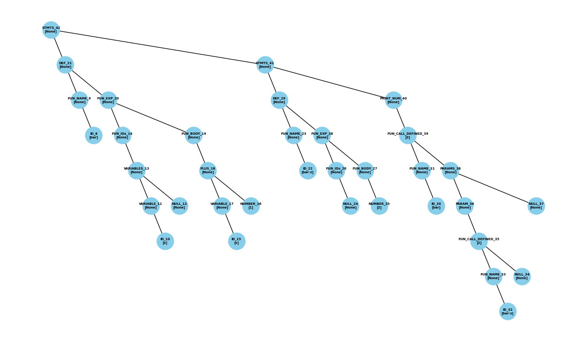

# PyMiniLisp
A mini LISP toy interpreter written in Python.

It's the final project of the course Compiler(CE3006*) in NCU, Taiwan.

Thanks to [ply](https://github.com/dabeaz/ply), a Python implementation of Lex and Yacc.
## Why Python?
Since the lex and yacc are not easy to debug, I choose Python to implement this project. 
Even I can visualize the AST.

## Basic Features
- [x] Syntax Validation
- [x] Print
- [x] Numerical Operations
- [x] Logical Operations
- [x] if Expression 
- [x] Variable Definition 
- [x] Function
- [x] Named Function

## Bonus Features
- [ ] Recursion
- [ ] Type Checking
- [ ] Nested Function
- [ ] First-class Function

Note: The bonus features are not implemented yet.
For more details, please check the [doc](doc) directory.

## Requirements
- Python 3.11

See [requirements.txt](requirements.txt) to install the dependencies.

Please make sure [ply](ply) directory is in the same directory as [main.py](main.py).

## Usage

### Normal Mode

Set the `IS_DEBUG` to `False` in [main.py](main.py) and put your code in [input.txt](input.txt).
and run the following command.

```bash
python main.py
```

you will get the result in Console.

#### Example
##### input.txt
```lisp
(define max (fun (x y) (if (> x y) x y)))
(define min (fun (x y) (if (< x y) x y)))

(define a 3)

(print-num (max 1 2))
(print-num (min 1 2))
(print-num (max a 2))
(print-num (min a (min 1 2)))
```
##### Output
```
2
1
3
1
```

### Debug Mode

Set the `IS_DEBUG` to `True` in [main.py](main.py) and put your code in [input.txt](input.txt).
and run the following command.

```bash
python main.py
```

you will get the result and many debug information in Console.
Finally, the visualization of AST will show up.

#### Example 
##### input.txt ([08_2.lsp](test_data/08_2.lsp))
```lisp
(define bar (fun (x) (+ x 1)))
(define bar-z (fun () 2))
(print-num (bar (bar-z)))
```
##### Output
```
Tokens:
LPAREN (
DEF define
ID Node('ID', 'bar',[])
LPAREN (
FUN fun
LPAREN (
ID Node('ID', 'x',[])
RPAREN )
LPAREN (
PLUS +
ID Node('ID', 'x',[])
NUMBER Node('NUMBER', 1,[])
RPAREN )
RPAREN )
RPAREN )
LPAREN (
DEF define
ID Node('ID', 'bar-z',[])
LPAREN (
FUN fun
LPAREN (
RPAREN )
NUMBER Node('NUMBER', 2,[])
RPAREN )
RPAREN )
LPAREN (
PRINT_NUM print-num
LPAREN (
ID Node('ID', 'bar',[])
LPAREN (
ID Node('ID', 'bar-z',[])
RPAREN )
RPAREN )
RPAREN )
------------------------------
Accepted
AST:
Node('STMTS', None,[Node('DEF', None,[Node('FUN_NAME', None,[Node('ID', 'bar',[])]), Node('FUN_EXP', None,[Node('FUN_IDs', None,[Node('VARIABLES', None,[Node('VARIABLE', None,[Node('ID', 'x',[])]), Node('NULL', None,[])])]), Node('FUN_BODY', None,[Node('PLUS', None,[Node('VARIABLE', None,[Node('ID', 'x',[])]), Node('NUMBER', 1,[])])])])]), Node('STMTS', None,[Node('DEF', None,[Node('FUN_NAME', None,[Node('ID', 'bar-z',[])]), Node('FUN_EXP', None,[Node('FUN_IDs', None,[Node('NULL', None,[])]), Node('FUN_BODY', None,[Node('NUMBER', 2,[])])])]), Node('PRINT_NUM', None,[Node('FUN_CALL_DEFINED', None,[Node('FUN_NAME', None,[Node('ID', 'bar',[])]), Node('PARAMS', None,[Node('PARAM', None,[Node('FUN_CALL_DEFINED', None,[Node('FUN_NAME', None,[Node('ID', 'bar-z',[])]), Node('NULL', None,[])])]), Node('NULL', None,[])])])])])])
------------------------------
AST BFS:
STMTS:None 
DEF:None STMTS:None 
FUN_NAME:None FUN_EXP:None DEF:None PRINT_NUM:None 
ID:bar FUN_IDs:None FUN_BODY:None FUN_NAME:None FUN_EXP:None FUN_CALL_DEFINED:None 
VARIABLES:None PLUS:None ID:bar-z FUN_IDs:None FUN_BODY:None FUN_NAME:None PARAMS:None 
VARIABLE:None NULL:None VARIABLE:None NUMBER:1 NULL:None NUMBER:2 ID:bar PARAM:None NULL:None 
ID:x ID:x FUN_CALL_DEFINED:None 
FUN_NAME:None NULL:None 
ID:bar-z 
------------------------------
Result:
3
------------------------------
Variable Dictionary:
defaultdict(None, {})
Function Dictionary:
defaultdict(None, {'bar': <__main__.Function object at 0x00000239CF2C7290>, 'bar-z': <__main__.Function object at 0x00000239CF2C67D0>})
Function Stack:
[]
Status Stack:
[]
```
##### AST Visualization


## Use Public Test Data
Because we need to pass the public test data to pass the course, I provide a script to run the public test data.

You can put your own test data set in [test_data](test_data) directory.

Note: I skip the bonus features test cases which file name start with 'b'.

Before running the script, please make sure `IS_DEBUG` is set to `False` in [main.py](main.py).

```bash
python test_data.py
```

##### Output
```
Running main.py with input file: 01_1.lsp
syntax error
Running main.py with input file: 01_2.lsp
syntax error
Running main.py with input file: 02_1.lsp
1
2
3
4
Running main.py with input file: 02_2.lsp
0
-123
456
Running main.py with input file: 03_1.lsp
133
2
-1
-256
Running main.py with input file: 03_2.lsp
1
0
9
Running main.py with input file: 04_1.lsp
#t
#f
#f
#t
#t
#f
#f
#t
Running main.py with input file: 04_2.lsp
#t
#t
#f
Running main.py with input file: 05_1.lsp
1
2
Running main.py with input file: 05_2.lsp
6
1
Running main.py with input file: 06_1.lsp
1
6
Running main.py with input file: 06_2.lsp
26
Running main.py with input file: 07_1.lsp
4
9
Running main.py with input file: 07_2.lsp
610
0
Running main.py with input file: 08_1.lsp
91
Running main.py with input file: 08_2.lsp
3
```

## Note
The visualization is the most interesting part of this project for me :)

If you can see the note here, I bet you are also someone who struggles with yacc and lex. So you turn to Python.

You can also check [lex_and_yacc](lex_and_yacc) directory to see how I struggle with yacc and lex. It only works for first 6 features.

It still has some bugs, because I code according to the test data. So it may not work for other test data.

@EditTime : 2023-12-27 21:39


